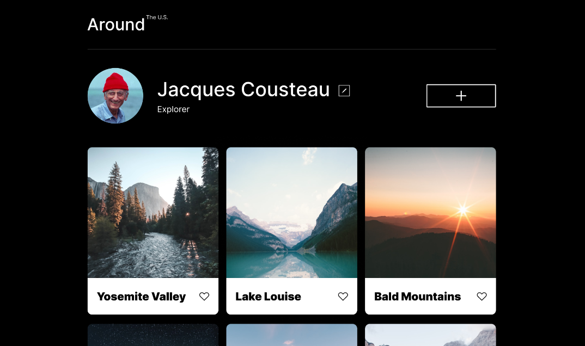
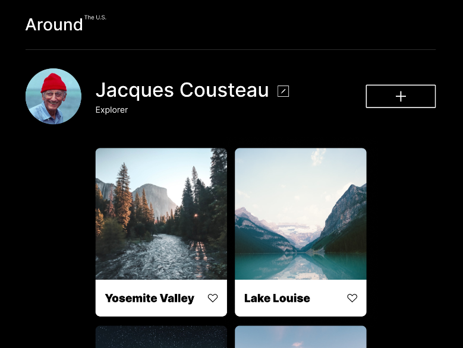
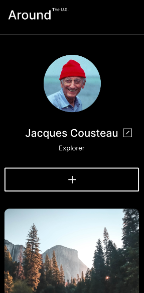

# Project 3: Around The U.S.

### Overview

- Intro
- Figma
- Technologies
- Images

**Intro**

This project is made so all the elements are displayed correctly on popular screen sizes. We recommend investing more time in completing this project, since it's more difficult than previous ones.

**Figma**

- [Link to the project on Figma](https://www.figma.com/file/ii4xxsJ0ghevUOcssTlHZv/Sprint-3%3A-Around-the-US?node-id=0%3A1)

**Technologies**

In this project, I used HTML and CSS to achieve a responsive design. Unlike previous projects, this one adapts seamlessly to any screen size, ensuring optimal display without issues. I minimized the use of media queries by leveraging CSS Grid properties.

**Images**

|  |  |  |
| :----------------------------: | :--------------------------: | :--------------------------: |
|             1200px             |            800px             |            320px             |

### Walkthrough Video

- [Clic here!](https://correouisedu-my.sharepoint.com/:v:/g/personal/gabriel2200141_correo_uis_edu_co/EbNX6kZFLMZIm18njzmZl4QBmuzSXWAN7TjuvSQ8onPC5g?nav=eyJyZWZlcnJhbEluZm8iOnsicmVmZXJyYWxBcHAiOiJPbmVEcml2ZUZvckJ1c2luZXNzIiwicmVmZXJyYWxBcHBQbGF0Zm9ybSI6IldlYiIsInJlZmVycmFsTW9kZSI6InZpZXciLCJyZWZlcnJhbFZpZXciOiJNeUZpbGVzTGlua0NvcHkifX0&e=FVeOFC) _You should put the video in 1.2x speed 😅_

### Page on Github Pages

- [Clic here](https://klinn2318.github.io/se_project_aroundtheus/)
